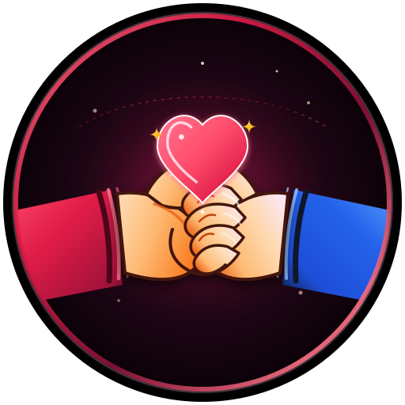

# BetweenUs — Long-Distance Relationship Sanctuary 💕

> A private, real-time sanctuary crafted specifically for couples bridging physical distance. Features synchronized reunion countdowns, real-time private messaging with voice notes and media, interactive couple games, virtual date planning, safety & emergency protocols, and offline-capable PWA support.



---

## ✨ Key Features

- **💑 Couple Synchronized Space**:
  - Live distance calculation in miles and kilometers with time zone sync.
  - Days together tracker and milestone countdown to next reunion (e.g. Reunion in Paris).
  - Couple Partner Simulator to toggle and test perspectives instantaneously.

- **💬 Private Couple Chat**:
  - End-to-end dedicated channel with instant quick love taps (Hugs, Kisses, Cuddles, Thinking of You).
  - Image sharing, voice notes, and reactions.
  - Real-time cross-tab BroadcastChannel and Firestore persistence.

- **🎮 Connection Games & Quizzes**:
  - *Would You Rather*, *Couple Trivia Quiz*, *This or That*, and *Never Have I Ever*.
  - Turn-based answers with scorekeeping.

- **🎨 Holding Hands Brand & Vector Artwork**:
  - Custom vector logo featuring two hands tightly clasping across distance with a glowing connection heart.
  - Available as app icon, browser favicon, and high-res vector export.

- **🚨 Safety Center & Emergency SOS**:
  - One-tap global emergency dialing customized to current country code (911, 112, 999, 000).
  - Trusted emergency contacts with auto-location messaging.
  - Instant location sharing and emergency kill-switch.

- **📱 Progressive Web App (PWA)**:
  - Installable on iOS (Safari Home Screen) and Android (Chrome).
  - Fullscreen standalone mode, custom app shortcuts, and offline service worker caching.

---

## 🛠️ Tech Stack

- **Framework**: React 18 with TypeScript
- **Build Tool**: Vite
- **Styling**: Tailwind CSS
- **Icons**: Lucide React
- **Persistence**: Firebase Firestore & Firebase Auth + LocalStorage failover
- **Real-Time**: BroadcastChannel API + Firestore snapshot listeners
- **PWA**: Web App Manifest & Service Worker

---

## 🚀 Getting Started

### Prerequisites

- Node.js (v18 or higher)
- npm or yarn

### Installation

```bash
# Clone the repository
git clone <your-repo-url>
cd betweenus

# Install dependencies
npm install

# Start the local development server
npm run dev
```

Open [http://localhost:3000](http://localhost:3000) in your browser.

### Building for Production

```bash
npm run build
```

---

## 🔒 Privacy & Safety

All messages, couple milestones, and location coordinates are protected. The app includes an immediate **Kill Switch** in the Safety Center to instantly revoke and wipe all active location coordinates at any time.

---

## 📄 License

MIT License. Crafted with ❤️ for long-distance couples everywhere.
